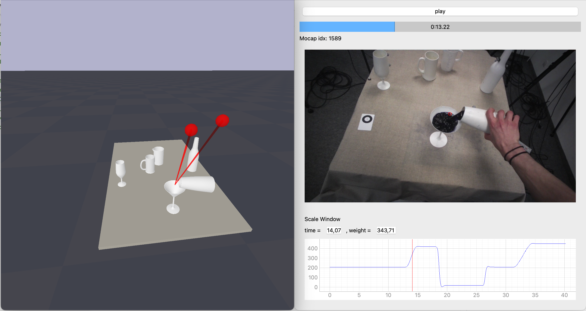

Code to replay data from the pouring dataset. Mocap, scale, and gaze streams are automatically synchronized during playback.

The visualization includes:
  - 3D mocap scene
  - Eye-tracking video (optional)
  - Scale data plot
  - Playback controls



# Installation

This project is managed using **uv**.

```bash
uv sync
```

---

# Usage

## Download the dataset

TODO

### Dataset Structure

The recorded data is organized into two main directories:

```
pouring_dataset/
├── data/
└── projects/
```

- `data/`  
  Contains **mocap**, **scale**, and metadata (including references to Tobii recordings).

- `projects/`  
  Contains **Tobii Pro Glasses 2 recordings**, following the original Tobii directory structure.

---

## Playback

Use the following command to replay a recording:

```bash
uv run python main.py \
  --dataset_path /path/to/pouring_dataset \
  --mocap_only 1 \
  --rec_time_stamp 02062025092559
```

---

## Arguments

- `--dataset_path`  
  Path to the root dataset directory (`pouring_dataset`)

- `--rec_time_stamp`  
  Timestamp of the recording to replay  
  Format: `ddmmyyyyhhmmss`  
  If not provided, the latest recording is used

- `--mocap_only`  
  - `0` → display mocap + Tobii RGB video  
  - `1` → display mocap only  
  Default: `0`

- `--scene_json`  
  Path to a custom scene json file (optional)  
  If not provided, the default scene configuration is used from object_models folder

---